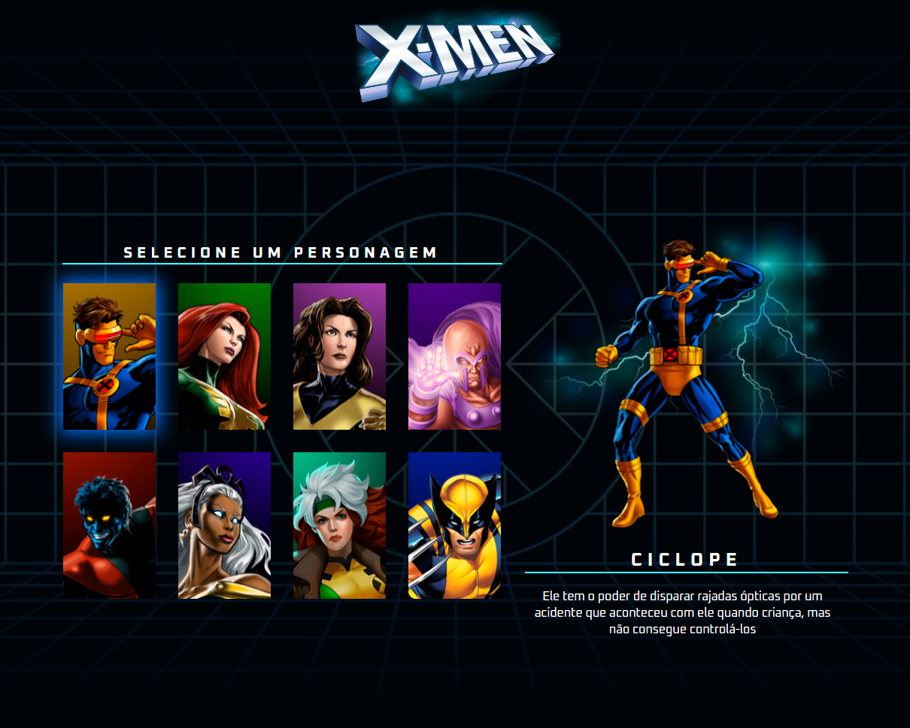

<h1 align="center"> X-MEN </h1>

Programa desenvolvido durante a semana do zero ao programador contratado junto com os irmãos do canal Dev em Dobro.  

  <a href="#-tecnologias">Tecnologias</a>&nbsp;&nbsp;&nbsp;|&nbsp;&nbsp;&nbsp;
  <a href="#-projeto">Projeto</a>&nbsp;&nbsp;&nbsp;|&nbsp;&nbsp;&nbsp;
  <a href="#-layout">Layout</a>&nbsp;&nbsp;&nbsp;|&nbsp;&nbsp;&nbsp;
  <a href="#memo-licença">Licença</a>

  

 

  

## 🚀 Tecnologias

Esse projeto foi desenvolvido com as seguintes tecnologias:

- HTML e CSS
- JavaScript
- Git e Github
- Figma

## 💻 Projeto

Projeto Desenvolvido durante o evento do zero ao programador contratado, na qual consiste em uma lista de seleção de personagem, simulando alguns jogos arcade, o projeto possuí responsividade. 

## :memo: Licença
